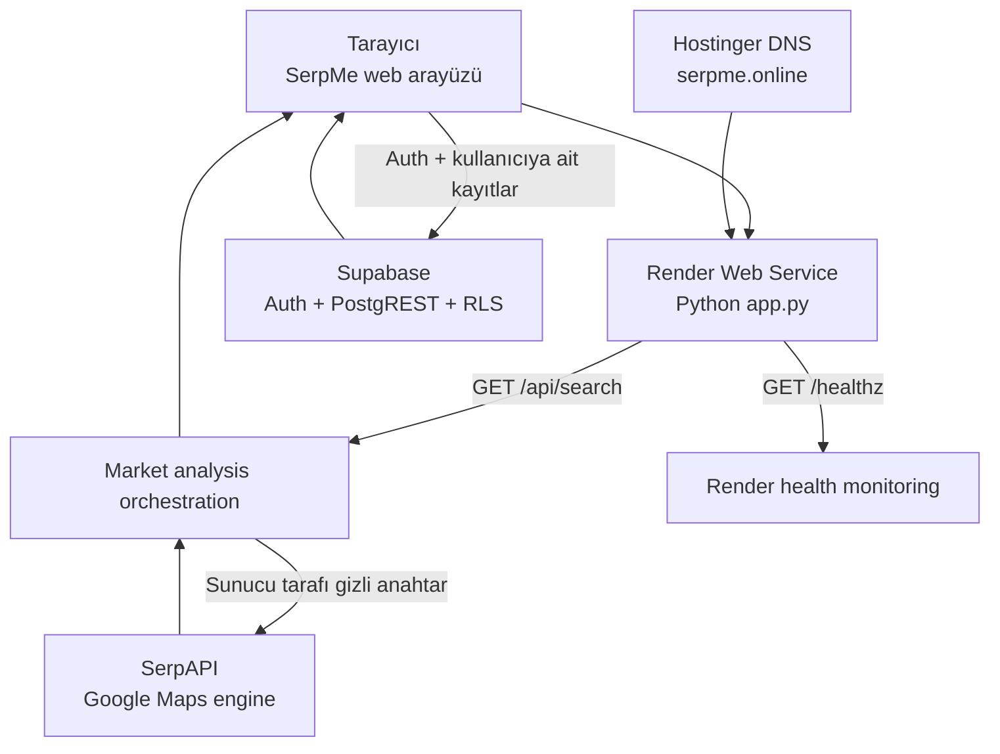

# SerpMe Sistem Mimarisi

Bu doküman, SerpMe'nin üretimdeki web uygulaması, canlı pazar analizi, kullanıcı hesabı, portföy, talep doğrulama ve Concept Studio bileşenleri için kaynak mimari tanımıdır. Metriklerin kaynağı ve sınırı açıkça belirtilir; desteklenmeyen veri tahmin edilmez.

## Sistem özeti



### Sorumluluk sınırları

- **Tarayıcı:** Formlar, rapor görünümü, hesap oturumu, Concept Studio, ücretsiz Canvas 3D görünümü ve kullanıcı tarafından girilen talep kanıtları. SerpAPI anahtarına erişemez.
- **Render uygulaması:** Statik varlıkların güvenli sunumu, `/api/search` istek doğrulaması, SerpAPI proxy'si, önbellek, hız limiti ve analiz hesaplama.
- **SerpAPI / Google Maps:** Görünür yerel işletme sonuçları. Nüfus, kira, gerçek yaya trafiği veya satış verisi sağlamaz.
- **Supabase:** E-posta tabanlı kimlik doğrulama, kullanıcıya ait fikir ve rapor kayıtları. Satır düzeyi güvenlik ile her kullanıcı yalnızca kendi verisini görür.
- **Hostinger ve Render:** Hostinger yalnızca DNS çözümleme, Render ise HTTPS sertifikası ve uygulama barındırma sağlar.

```mermaid
flowchart LR
  U[Web arayüzü] --> V[İstek doğrulama]
  V --> L[Konum çözümleme]
  L --> S[SerpAPI Google Maps adaptörü]
  S --> R[Ham yerel sonuçlar]
  R --> A[Pazar analiz motoru]
  A --> C[Konsept eşleştirme motoru]
  A --> F[Finansal plan motoru]
  C --> LAY[Konsept Stüdyosu & yerleşim motoru]
  LAY --> V3[Tarayıcıda canlı 3D konsept maketi]
  C --> O[Rapor & öneri katmanı]
  F --> O
  O --> U
  H[Platform sağlık denetimi] --> P[/healthz]
```

## Katmanlar

- **Web arayüzü:** İşletme, detaylı mikro-konum, yarıçap, konsept adayları ve finansal varsayımları toplar.
- **İstek doğrulama:** Boş alanları, koordinat aralığını ve yarıçapı denetler.
- **Konum çözümleme:** İşletme tipi ile mahalle, cadde veya açık adresi tek bir Google Maps sorgusunda birleştirir.
- **SerpAPI adaptörü:** API anahtarını sadece sunucuda `.env` üzerinden kullanır; istemciye asla göndermez.
- **Pazar analiz motoru:** Rakip yoğunluğu, puan, yorum talebi ve açık işletme oranını hesaplar.
- **Konsept eşleştirme motoru:** Her aday için ayrı Google Maps sorgusu yapar; mikro-konum ve kategori eşleşmeyen işletmeleri dışarıda bırakır.
- **Finansal plan motoru:** Kullanıcının kira, sabit gider, sepet ve brüt marj varsayımlarından başa baş hedefini üretir.
- **Dağıtım katmanı:** Docker imajı uygulamayı çalıştırır; platform `GET /healthz` ile hizmet durumunu denetler. `SERPAPI_KEY` üretimde platformun gizli ortam değişkeni olarak tanımlanır.
- **Güvenlik katmanı:** Statik dosya izin listesi `.env` erişimini engeller; IP başına istek sınırı, sabit boyutlu beş dakikalık önbellek ve saatlik SerpAPI çağrı bütçesi anahtarın dolaylı kullanımını sınırlar. Güvenlik başlıkları tarayıcı saldırı yüzeyini sınırlar; konteyner yetkisiz kullanıcı ile çalışır.

## Konsept Stüdyosu, yerleşim ve optimizasyon

Konsept Stüdyosu, pazar analizinden ayrı çalışan bir ön tasarım katmanıdır. Net alan, cephe, konsept, servis modeli, erişilebilirlik tercihi ve konsepte özgü operasyon parametrelerinden düzenlenebilir kat planı üretir. Bu katman ruhsat, yangın veya statik proje yerine geçmez; uygulama projesi öncesindeki karar ve kapasite çalışması içindir.

### Başlangıç yerleşimi

1. Seçilen servis profili; karşılama, servis/mutfak, depo ve dolaşım için başlangıç alan oranlarını tanımlar.
2. Kullanıcının mutfak, depo veya sergileme alanı girdileri varsa bu oranlar ilgili profil varsayımını değiştirir.
3. Konuk/satış alanı, `net alan - sabit operasyon alanları` mantığıyla hesaplanır. Perakendede kullanıcının sergileme alanı tercihi doğrudan kullanılabilir.
4. Eş zamanlı kapasite, konuk/satış alanının konsept profilindeki kişi başına alan varsayımına bölünmesiyle hesaplanır. Günlük kapasite, servis turu veya randevu/oda/istasyon modeline göre türetilir.
5. Alanlar yüzde tabanlı bir plan ızgarasına yerleştirilir. Bu sayede plan, farklı ekranlarda aynı ölçek mantığıyla düzenlenir.

### Kullanıcı kısıtları ve yeniden optimizasyon

Kullanıcı alanları sürükleyebilir; duvar, sabit engel, kapı, lavabo ekleyebilir, biçim-boyut-açı değiştirebilir ve yeni kat oluşturabilir. Her kat bağımsız veri olarak tutulur.

- **Çakışma kontrolü:** “Engellere göre optimize et” komutu, aktif kattaki her fonksiyon alanını duvar, engel ve lavabo ile eksen hizalı dikdörtgen kesişim kontrolünden geçirir.
- **Düzeltme:** Bir kesişme varsa ilgili alan, engelin altına `engel yüksekliği + %3` boşluk bırakacak şekilde taşınır; plan sınırları aşılmaz.
- **Kapasite etkisi:** Aktif kattaki her engel `1,6 m²`, her lavabo `1,4 m²`, her duvar `0,7 m²` dolaşım/işletim cezası üretir. Güncel eş zamanlı kapasite, bu cezanın kişi başına alan varsayımına bölünmesiyle azaltılır. Günlük kapasite de yeni eş zamanlı kapasite oranıyla ölçeklenir.
- **Şeffaflık:** Sonuçta kullanıcıya aktif kat için kapasite ve uygulanan optimizasyon durumu gösterilir. Sistem, kısıt eklenmesini otomatik olarak “daha iyi” kabul etmez.

Bu yöntem hızlı, açıklanabilir bir ön yerleşim optimizasyonudur. Yangın kaçış mesafesi, kolon aksları, tesisat şaftları, yerel erişilebilirlik mevzuatı, taşıyıcı sistem, mutfak havalandırması ve gerçek mobilya ölçüleri için yetkili mimar/uygulama projesi kontrolü gerekir.

### Ücretsiz canlı 3D konsept maketi

Plan onaylandığında tarayıcıdaki Canvas katmanı, aktif katın yüzde tabanlı koordinatlarını izometrik üç boyutlu görünüme çevirir. Zemin, dış/iç duvar, pencere, kapı, lavabo, engel, karşılama-servis birimleri, aydınlatma ve seçilen modele göre masa-sandalye veya raf düzeni çizilir. Bu görüntü plan değiştiğinde anında yeniden çizilir ve dış görsel API’si, gizli anahtar veya kullanıcı kredisi kullanmaz. İki farklı izometrik açı desteklenir.

## SerpAPI parametreleri

- `engine=google_maps`: Google Maps motoru.
- `type=search`: Yerel işletme listesi.
- `q`: İşletme tipi ile mikro-konumu içeren arama metni.
- `hl=tr`: Türkçe Google Maps bağlamı.
- `api_key`: Sadece sunucuda tutulan SerpAPI anahtarı.

## Analiz parametreleri

- **Harita yoğunluğu:** Görünen rakip sayısı, işletme başına yorum ve açık işletme oranı.
- **Karşılaştırma uyumu:** Mikro-konum eşleşmesi, kategori eşleşmesi, puan, yorum hacmi ve Google Maps sırası.
- **Fırsat skoru:** Talep ve kalite boşluğunu artırır; aşırı rekabeti düşürür.
- **Başa baş işlem/adet:** `(kira + sabit gider) / (ortalama sepet × brüt marj)`; aylık sonuç 30 güne bölünür.
- **İşletme sermayesi:** Üç aylık sabit gider tamponu. Vergi, yatırım harcaması, kredi ve amortisman bu MVP’de ayrı ele alınmalıdır.

## Canlı pazar analizi akışı

1. Kullanıcı işletme tipi, mikro-konum, yarıçap ve en fazla üç karşılaştırma konsepti gönderir.
2. Render, giriş boyutlarını ve yarıçapı sınırlar; istemci/IP ve sağlayıcı çağrı bütçesini denetler.
3. Sunucu doğrudan işletme sorgusunu 500 m, 1 km, 2 km, 3 km ve 5 km mantığında genişletir. Ticari aktivite, hedef müşteri varlığı, erişilebilirlik ve dolaylı talep için ayrı proxy sorguları çalıştırır.
4. Sonuçlar kimlik bilgisine göre birleştirilir; doğrudan rakip sayısı 0–2 ise `demand_validation`, 3–10 ise `early_market`, 10+ ise `competition` modu seçilir.
5. Market Viability Score şu sabit ağırlıkları kullanır: talep %30, ticari aktivite %20, hedef müşteri varlığı %15, erişilebilirlik %10, rekabet boşluğu %10, komşu pazar sinyali %10, konum uyumu %5.
6. Rapor, skorla birlikte veri güveni, alt skorlar, veri sınırları ve aksiyon önerilerini döndürür. Sağlayıcı erişilemezse sonuç `demo` olarak işaretlenir; canlı veri gibi gösterilmez.

## Talep doğrulama mimarisi

Talep doğrulama, Google Maps'teki arz/rakip verisinden bağımsızdır. Kullanıcı ölçüm girmeden gerçek talep varmış gibi yorum yapılmaz.

### Ortak fikir şeması

Her fikir; hedef müşteri, çözülecek ihtiyaç, fiyat aralığı, satış modeli, konum ve fizibilite aşaması ile tanımlanır. Bu zorunlu tanım, farklı fikirlerin aynı değerlendirme dilinde karşılaştırılmasını sağlar.

### Kanıt katmanları

1. **Arama niyeti:** Kullanıcının aynı konu/anahtar kelime ve coğrafya ile aldığı 0–100 göreli arama ilgisi. Bu satış hacmi değildir.
2. **Ücretli taahhüt:** Yalnızca ücretli ön sipariş, depozito, rezervasyon veya örnek satış sayısı ve önceden belirlenmiş hedefi.
3. **Gözlenen davranış:** Sabah, öğle ve akşam için 15 dakikalık saha yaya sayımları ile minimum toplam eşik.

Üç kanıt türünün tamamı yoksa skor oluşturulmaz ve durum `Evidence incomplete` kalır. Tam veri olduğunda skor formülü şudur:

`0.25 × arama niyeti + 0.45 × min(ücretli taahhüt/hedef, 1) × 100 + 0.30 × min(yaya toplamı/eşik, 1) × 100`

Skor >=70 ise sınırlı lansman doğrulaması, 45–69 ise tekrar test, <45 ise fikri yeniden tanımlama önerilir. Bu karar yatırım tavsiyesi değildir; ham ölçümler rapora kaydedilir.

## Kimlik doğrulama ve portföy akışı

1. Kullanıcı `Log in` ile Supabase Auth'a gider veya e-posta onaylı hesap oluşturur.
2. Oturum yalnızca tarayıcıda saklanır; isteklerde kullanıcının erişim belirteci Supabase'e taşınır.
3. Kullanıcı bir raporu kaydettiğinde önce `ideas`, sonra buna bağlı `reports` kaydı oluşturulur.
4. Rapor kaydında pazar analizi, finansal varsayımlar, doğrudan/proxy sonuçlar, fizibilite notu ve talep doğrulama ham verisi `report_payload` içinde saklanır.
5. Supabase RLS politikaları, kayıtları `owner_id` üzerinden oturumdaki kullanıcıyla sınırlar. Çıkışta uzak Supabase oturumu sonlandırılır ve yerel oturum silinir.

## Güvenlik, güvenilirlik ve operasyon

- `SERPAPI_KEY` yalnızca Render ortam değişkenidir veya yerelde `.env` dosyasında tutulur; Git'e, tarayıcı koduna veya Supabase'e yazılmaz.
- Sunucu yalnızca izinli statik dosyaları sunar; `.env`, git verisi ve diğer çalışma dosyaları istekle okunamaz.
- CSP, `X-Content-Type-Options`, `X-Frame-Options`, referrer policy, HSTS ve permissions policy başlıkları uygulanır.
- SerpAPI çağrıları istek hızı, saatlik sağlayıcı bütçesi ve kısa süreli yanıt önbelleği ile maliyet/istismar riskine karşı sınırlandırılır.
- Tarayıcıda gösterilen kullanıcı kaynaklı portföy verileri HTML kaçışlamasıyla işlenir.
- Docker imajı gerekli tüm varlıkları içerir; `.env` ve `.git` `.dockerignore` ile imaj dışında kalır.
- Dağıtım zinciri: yerel commit → GitHub `main` → Render otomatik deploy → `/healthz` kontrolü → özel alan adı üzerinden HTTPS.

## Bilinen sınırlar ve sonraki adımlar

- Google Maps sonuçları görünür listeyle sınırlıdır; gerçek nüfus, kira, ciro, satış dönüşümü ve tam yaya trafiği ölçülmez.
- Talep doğrulama verileri kullanıcı tarafından ölçülür; kaynak, tarih ve eşiklerin ileride kayıt arayüzünde zorunlu hale getirilmesi önerilir.
- Concept Studio ön tasarım aracıdır; yangın, statik, havalandırma, erişilebilirlik ve ruhsat için yetkili profesyonel onayı gerekir.
- Gelecek sürümde rapor sürümleme, konservatif/baz/iyimser finansal senaryolar, sınırlı lansman deneyi kaydı ve paylaşılabilir salt-okunur rapor bağlantıları eklenmelidir.
